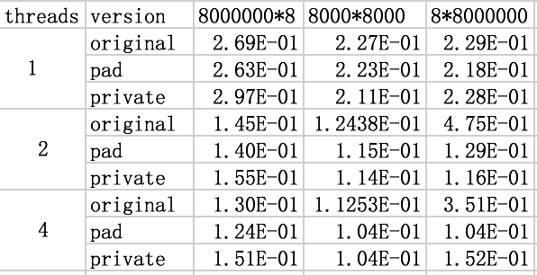

#homework assignement2
5142029014 高超  

**4.16**  
the 8000 components of y will be distributed to 4 threads.  
thread 0: y[0], y[1], ... , y[1999]  
thread 1: y[2000], y[2001], ... , y[3999]  
thread 2: y[4000], y[4001], ... , y[5999]  
thread 3: y[6000], y[6001], ... , y[7999]   
Suppose two threads with seperate caches access diffrent variables that belongs to the same cache line, this is called false sharing.  
Now we can consider the thread 0 and thread 2. For thread 0, the cache line that contains y[1999] is closest to the elements assigned to thread 2. The ideal case is that y[1999] is the first element of the cache line.  So we have  
`y[1999] y[2000] y[2001]  y[2001]  y[2002] y[2003] y[2004] y[2005] y[2006]` in a cache line.  

However, the least number is y[4000] in thread 2, so they can't be in the same cache line.  
Actually, the case for thread 0 and 3 is the same. 
 
In conclusion, false sharing will not happen between thread 0 and 2, and same result between thread 0 and 3.  

**4.17**  
*(a)* The vector y contains 8 elements, because a cache line is 64 bytes, the minimum number of cache lines that are needed to store the vector y is 1.  
`y[0] y[1] y[2] y[3] y[4] y[5] y[6] y[7]`  

*(b)* We can consider the worst case, y[0] is the last element in the first cache line, the remaining y can be stored in the second cache line.  
So the maximum number of cache lines that are needed to store the vector y is 2.  
` ----  ----   ----   ----   ----  ----   ----   y[0]`  
` y[1] y[2] y[3] y[4] y[5] y[6] y[7] ---- `  

*(c)* We only have to consider the place that y[0] is assigned to the cache line. Therefore, there are 8 different ways.  

*(d)* This is a simple math problem. There are 3 diffrent ways to assign four threads to the processors in our computer.  

*(e)* Yes, there exists no-false-sharing case. We assume that thread 0 and 1 are in the same processor, and thread 2 and 3 are in the same processor. It is possible that we have the following case:  
`---- ---- ---- ---- y[0] y[1] y[2] y[3]`  
`y[4] y[5] y[6] y[7] ---- ---- ---- ----`  
So they are in the different cache line, there is no false sharing.  

*(f)*  We have 3 ways to assign threads to processors, and we have 8 ways to assign the components of y to cache lines, so we have 3*8 = 24 ways totally.  

*(g)* It is obvious that each cache line should contain 4 elements if there is no false sharing. If not, there must exist at least three threads in one cache line, they must belong to two processors. Now we know thread 0 and 1 (thread 2 and 3)are in the same cache line, and they must be assigned to the same processor to avoid false sharing. Therefore, there is only 1 way (the solution in question(e)) resulting in no fasle sharing.  

**4.18**  
*(a)* We should make sure that different threads will not access the same cache line. So we can add the `8 * my_rank` to the index of result y so that the components in different threads will not appear in the same cachel line.  
Orignal version:
  
```
for (i = my_first_row; i < my_last_row; i++) {  
      y[i] = 0.0;  
      for (j = 0; j < n; j++) {
          temp = A[sub++];
          temp *= x[j];
          y[i] += temp;
      }
   }
```
Modified version:  

```
for (i = my_first_row; i <= my_last_row; i++) {
      y[i+(my_rank*8)] = 0.0;
      for (j = 0; j < n; j++)
          y[i+(my_rank*8)] += A[i*n+j]*x[j];
   }
```

*(b)* We can have a local array local_y[] for each thread, and after computing the array, map the local_y to y.  
Modified version:  

```
for (i = my_first_row; i < my_last_row; i++) {
      local_y[my_first_row - local_m] = 0.0;
      for (j = 0; j < n; j++)
          local_y[i - local_m] += A[i*n+j]*x[j];
   }

memcpy(y+my_first_row, local_y, local_m*sizeof(double));
```  

*(c)* Here is the table of running time(seconds).  
  
We can see that the pad implementation almost perform the best, and due to the time allocating and freeing the temporary storage, and copying the temporary storage into y, the private implementation not perform very well even compared to the original version.  
However, the two modified versions do perform well avoiding false sharing problems when the matrix is 8*8000000, on the contrary, the original implementation is bad.
