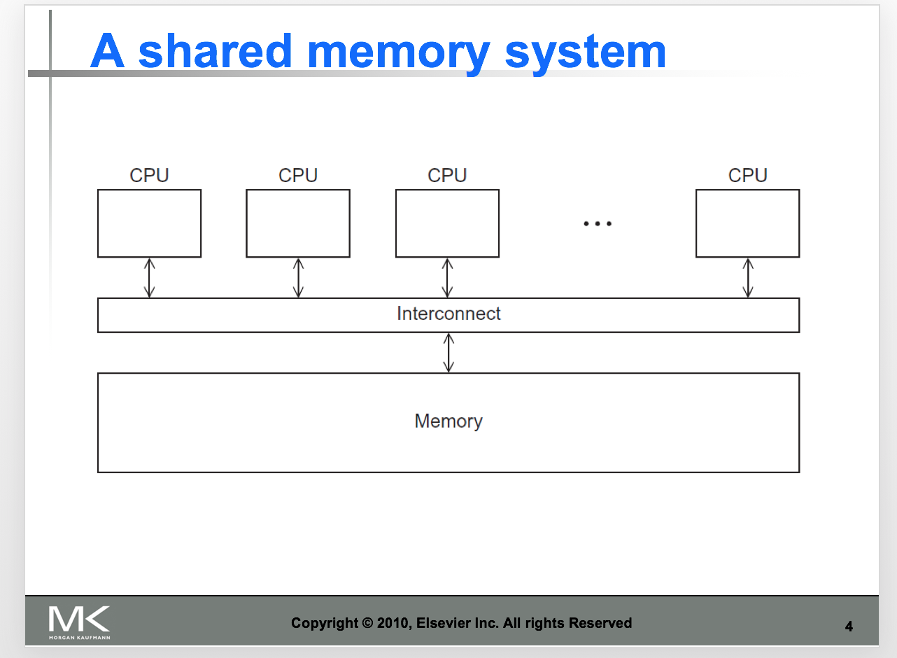
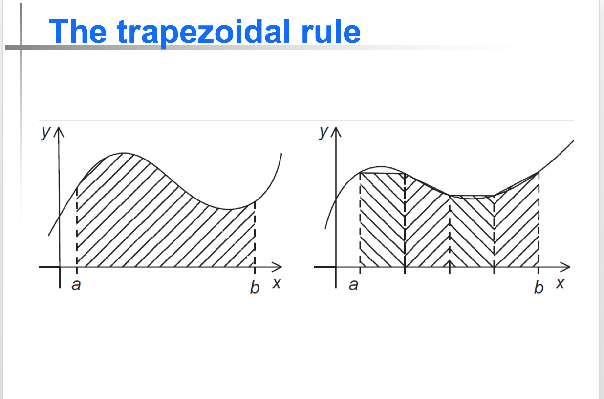

# OpenMp notes

An API for **shared-memory** parallel programming.

MP = multiprocessing

**Progmas**: special preprocessor in instructions. Typically added to a system to allow behaviors that aren't part of the basic C specification.

In OpenMP, the original thread and the new threads is called a **team**, the original thread is called the **master**, and the additional threads are called **slaves**.

see an example:

 

Naive thinking: we divide the calculations to some threads, and gather the results together.(global_result += my_result), but when two threads attempts to execute this, which may cause problems, so we can add `#progma omp critical` so only one thread can do this at a time.

**scope of variables**

shared scope    private scope

 

